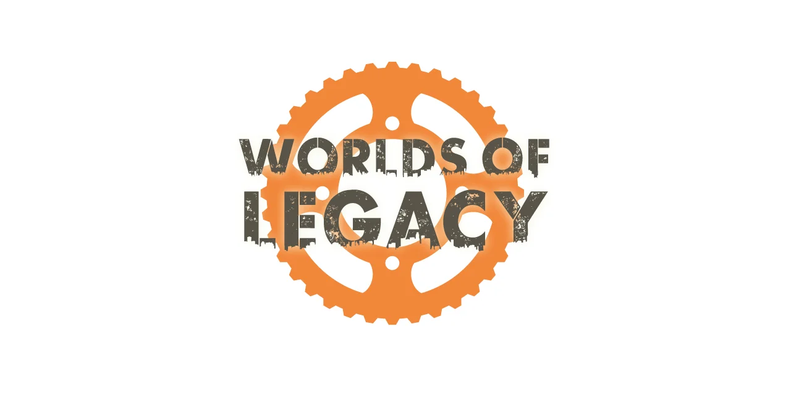

# The Worlds of Legacy SRD (PbtA) (Unofficial)

    
    
     
     
    
    

     
     
     
    

The Worlds of Legacy SRD is a system reference document that extracts the core mechanics from the post-apocalyptic RPG "Legacy: Life Among the Ruins," allowing players to create games using its unique dual-scale gameplay where each player controls both a group (hundreds of people operating over time) and individual characters from those groups for focused adventures. The system emphasizes collaborative worldbuilding, permanent world changes across generations, and storytelling that spans both intimate character moments and epic group sagas in a dangerous world filled with mysterious technology.

The ideas used in this module are from the [Worlds of Legacy SRD](https://ufopress.co.uk/the-world-of-legacy-srd/)

This module is for [Foundry VTT](https://foundryvtt.com/) and requires the [PbtA System](https://github.com/asacolips-projects/pbta) created by [asacolips](https://github.com/asacolips).

## Screenshot

## Dependencies
The following Foundry VTT game system must be installed to use this module: [Powered by the Apocalypse](https://foundryvtt.com/packages/pbta).

## How to Install
You can install the latest released version of the module by using this manifest link in Foundry VTT. [Instructions](https://foundryvtt.com/article/tutorial/): https://github.com/philote/worlds-of-legacy-pbta/releases/latest/download/system.json

## Features
- TBD

## TODO
- Everything

# License & Acknowledgements

This work is based on [Legacy: Life Among the Ruins](https://ufopress.co.uk/our-games/legacy-life-among-ruins/), product of UFO Press Limited, developed and authored by Jay Iles and Douglas Santana Mota, and licensed for our use under the [Creative Commons Attribution 3.0 Unported license](http://creativecommons.org/licenses/by/3.0/).

Legacy: Life Among the Ruins is © UFO Press Limited. The Worlds of Legacy logo is © UFO Press Limited, and is used with permission.

Icons from game-icons.net are released under a Creative Commons Attribution 3.0 Unported license. https://creativecommons.org/licenses/by/3.0/
